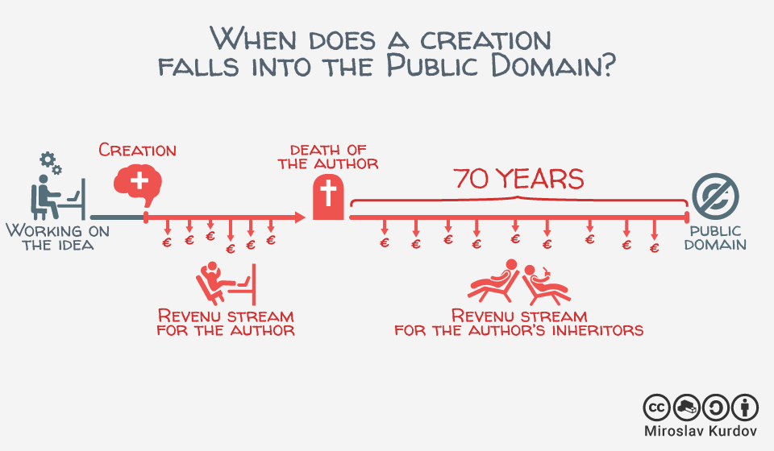

Copydocs
========

**Instant search** through documents relevant to copyright

----

Idea
====

* copyrightevidence.org is a great resource
* to enable people to discover more discussion around copyright, we wanted a **fast search**

----

Challenges
==========

* it's hard to get data out of the [media]wiki
* making sense of the data

----

Approach
========

* scrape the wiki
* extract text PDF
* index into elasticsearch
* responsive frontend

----

Technology
==========

* Python, JavaScript, elasticsearch, Illustrator, R

----

Outlook
=======

* search is a powerful paradigm
* add more data sources, recommended readings
* apply more text analysis

Thanks #Euh2016
===============

